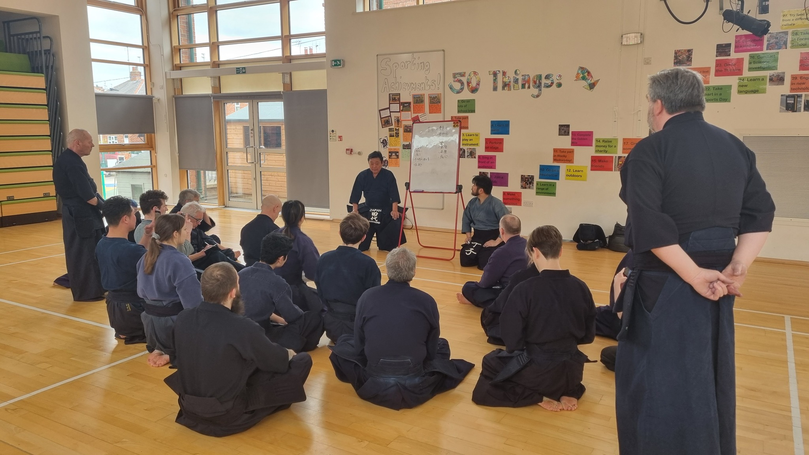
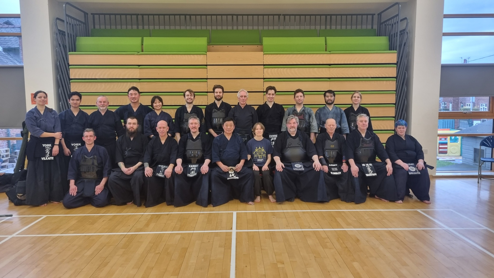

On the weekend 4-5th of March we attended the Tashiro seminar held at [York City Kendo Club](). The seminar was lead by Tashiro Sensei (8th Dan) who was visiting the UK on a teaching tour from Japan. The seminar was a great weekend, with lots of knowledge and advice given throughout by sensei. It was also a great opportunity to meet kendoka from around the UK!

On the second day of the seminar, Tashiro-sensei gave a lecture about the criteria of yuko-datostu, or a valid strike.

At the end of the second day we also took a group photo to celebrate the occasion!
