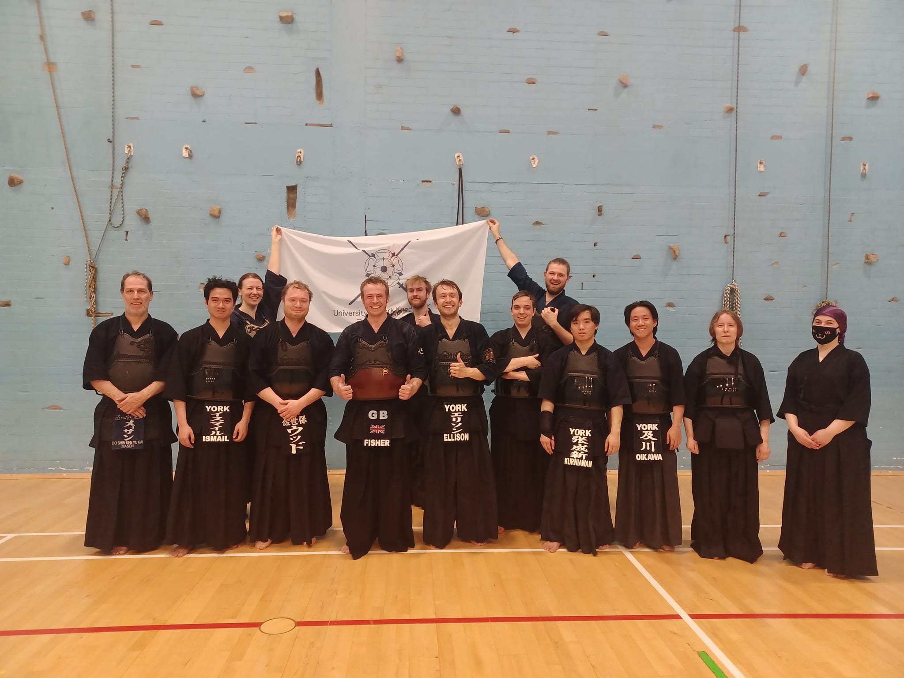

This weekend we were fortunate enough to be visited by Andy Fisher Sensei (6th Dan), CEO of [Kendostar](https://kendostar.com/) kendo equipment company and current coach of the GB national kendo team. Fisher Sensei joined our practice session and gave us many great insights into how we could improve our kendo. Some of us (myself included) were also able to do jigeiko with Fisher sensei, which was a great experience! We were also joined by Gareth Mason Sensei from the York City Kendo Club, who also provided an example of great kendo.

Below are some specific pieces of advice given to us by Fisher sensei:

**Kirikaeshi**

Firstly, it is important to start your men strike from toma (far distance), stepping in to your issoku ito no mai (one-step one-cut distance), and then from there making an attack without moving your feet. If you reach your issoku distance in a match and then need to take an additional step at the start of your attack, your opponent will likely stroke you first.
Secondly, after the large men strike, whether you make tai-atari or not, you should not stop you momentum before transitioning to your sayu men strikes. Your feet should keep moving fluildy between these 2 motions.
Finally, ideally each set of large men and sayu men strikes should be made in one breath. However, this is very difficult. The least that you should aim to do is make your final sayu men strike and final sayu men strike in the same breath.

**Large Men-uchi**

Fisher-sensei's advice here was with regards to zanshin (remaining spirit/awareness) after the men strike. When moving past your opponent after the strike, it is important to move through with good speed and reach a safe distance before turning. Importantly, your shout and spirit should remain loud and strong until you have passed the opponent and turned to face them. You should not let your shout or spirit trail off as you pass the opponent. Also, you should still have some breath remaining when you turn to face the opponent again. The idea here is that if necessary, you should be able to make another strike once you have passed the opponent and turned to face them.

If you make a strike on an opponent in a real match and allow your sprit and awareness to fade after the strike, then you are likely to recieve a strike yourself and concede an ippon.

**Small Men-uchi**
When raising the kensen (tip of the shinai) to make a small men strike, ideally the kensen should not go further back than the tsuba (guard), as this means the motion is too large. In addition, your arms must raise and be fully extended when making the strike, to allow you to reach the men-buton strike area on top on the men. If you do not extend the arms then the angle of your shinai will be too steep and you will likely hit the mengane (metal cage on front of the men). This is not the correct strike area and makes a different sound. At the same time, your shinai should not become too flat, such as parellel to the ground, as here you are over-extending your wrists.

**Kote-uchi**
The traditional teaching for kote is that you should start the technique further than you would for men, as the target is closer to you and so you travel less distance. However, Fisher-sensei's preference is to make kote from the same distance as men. This is because in a match, if you stand at the slightly further distance needed to make kote, the opponent may become aware that you are too far to strike men, and so will know that you will strike kote. Hence by striking kote from the same distance as men you can keep your options open.

To make this possible, you must make a smaller fumikomi. This means that you will move less distance during your strike and so can start closer. Your arms should also be fully extended during the kote strike.

Additionally, Fisher-sensei also stressed that kote strikes should not be too firm, and the power of the strike comes entirely from the tenouchi of your wrists, and not from the strength of your arms.

Finally, after making the kote strike and closing the distance to your opponent, the kensen should come over the opponent's right shoulder (your left). Then once you enter tsubazeriai, you can move the kensen over to the other side. Moving the kensen over too early can give the impression that you have "abandoned" your kote strike. In addition, by keeping the kensen forwards, you can easilly follow the kote with men if the opponent moves back after the strike.

Once again thank you very much to Andy Fisher sensei for visiting us, and we look forward to next time!
