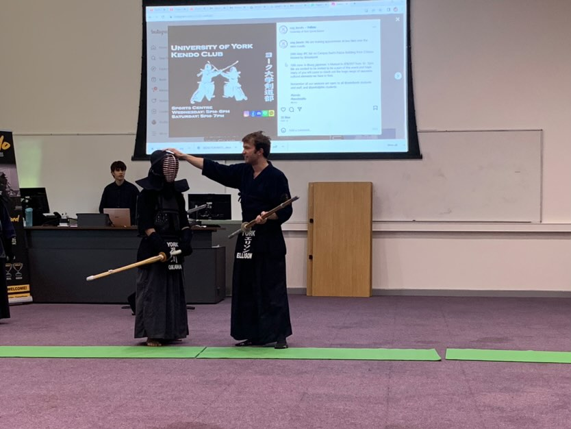
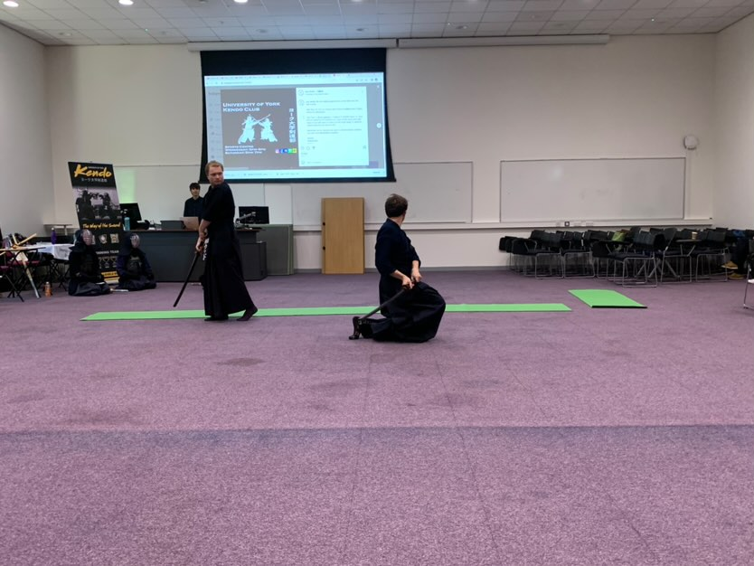

This weekend the University of York Japanese society held a matsuri (festival) to bring together a showcase of all the Japanese Culture societies at the Univeristy. We went along to the event to showcase Kendo and gave a display demonstration to the crowd.

Capion: A demonstration of the men strike area of the bogu.

The day was a great success and had a large number of attendees. The matsuri featured japanese food as well as demonstrations from many other societies inlcuding Origami, Iaido, and Judo. A particular highlight was the York St John University Taiko drumming troupe, who performed several very energetic pieces! They were joined for the performance by several members of the York [Tengu Taiko drummers](https://www.tengutaiko.com/about-us.html).

Caption: Demonstration of Kendo Kata number 7.

Overall the matsuri was a lot of fun, and we look forward to attending in the future!